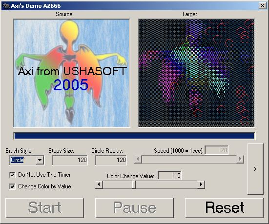



## Demo AZ666

### Description

Creating effects from an input image using varius shapes brush, animating the effect with timer and draw your owen effects...
 
### More Info
 
Image files

you can save you work as image files

             |
---                |---
**Submitted On**   |2005-04-09 03:37:08
**By**             |[Axi Nadee](https://github.com/Planet-Source-Code/PSCIndex/blob/master/ByAuthor/axi-nadee.md)
**Level**          |Intermediate
**User Rating**    |5.0 (10 globes from 2 users)
**Compatibility**  |VB 3\.0, VB 4\.0 \(16\-bit\), VB 4\.0 \(32\-bit\), VB 5\.0, VB 6\.0
**Category**       |[Graphics](https://github.com/Planet-Source-Code/PSCIndex/blob/master/ByCategory/graphics__1-46.md)
**World**          |[Visual Basic](https://github.com/Planet-Source-Code/PSCIndex/blob/master/ByWorld/visual-basic.md)
**Archive File**   |[Demo\_AZ6661874964102005\.zip](https://github.com/Planet-Source-Code/axi-nadee-demo-az666__1-59928/archive/master.zip)

